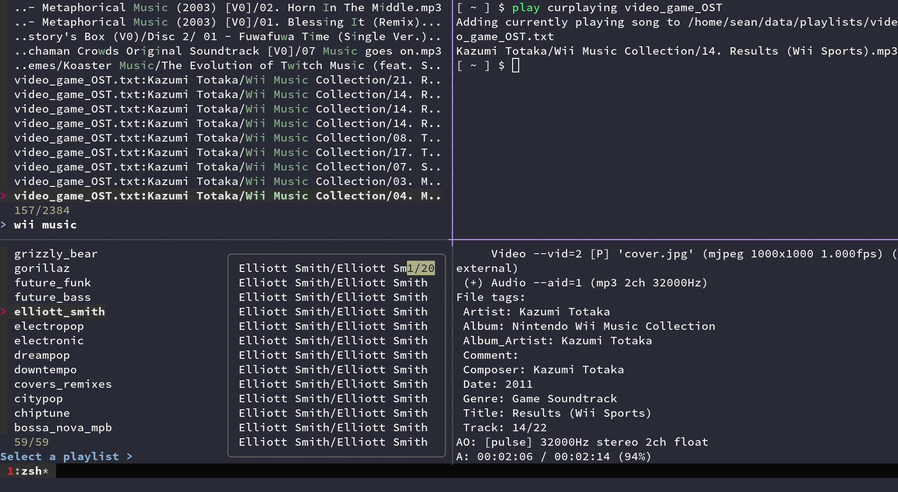
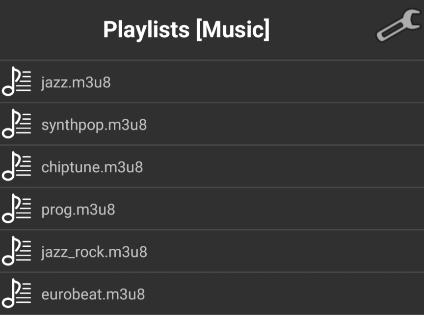

# plaintext-playlist



```
Usage: plainplay [-h] [-] [OPTIONS] [COMMAND [ARGS]]

	An interactive terminal playlist manager; stores playlists as text files
	run without a COMMAND to drop into interactive mode

	[playlist] specifies either the
	name (without the location/.txt extension)
	or the location of one of the playlists

	curplaying uses my mpv-currently-playing script from
	https://github.com/seanbreckenridge/mpv-sockets

Additional Flags:
	
	add: A hyphen (-) can be passed with to instead
	receive filenames from stdin. expects filenames to
	be in the correct format
	(cd to your Music dir and use find for good results)

	e.g.: find somedirectory -name "*.flac" | plainplay - add rock

	resolve: --auto-confirm to automatically
	use the closest match instead of prompting you to choose
	one of the closest matching files to fix broken filepaths

	m3u: --abs to use absolute paths for the generated m3u file,
	instead of paths relative to your Music directory

	m3u: --duration to include the duration in the m3u file

	e.g. plainplay --abs --duration m3u rock

add [playlist]                | Adds one or more songs to a playlist
curplaying [playlist]         | Adds a currently playing mpv song to a playlist
remove [playlist]             | Removes one of more songs from a playlist
play [playlist]               | Play songs from a playlist
playall [playlist]...         | Play songs from multiple playlists
shuffle [playlist]            | Shuffle songs from a playlist
shuffleall [playlist]...      | Shuffle songs from multiple playlists
single [playlist]             | Play a single song from a playlist
list [playlist]               | List songs in a playlist
listall [playlist]...         | List songs from multiple playlists
unique [playlist]             | Reduce a playlist to unique songs
exif [playlist]               | Displays exif data for items in a playlist
m3u [playlist]...             | Create a m3u playlist file from multiple playlists
edit [playlist]               | Edit a playlist file with your $EDITOR
playlist-create [playlist]    | Creates a new playlist - a playlist file
playlist-delete [playlist]    | Delete an existing playlist - a playlist file
playlist-list                 | List the full paths of each of your playlist files
playlistdir                   | Print the location of the playlist directory
check                         | Makes sure that all songs in all your playlists exist
resolve                       | Attempts to fix broken paths in playlists
```

## Rationale

I wanted a minimal, scriptable-friendly playlist for my local music, without having to rely on a third party playlist manager/GUI interface.

_This stores playlists as text files, one per playlist, where each line is the (relative) path to a song in the playlist._

This includes a [`fzf`](https://github.com/junegunn/fzf) backed interactive mode. If you don't provide a playlist, this drops into interactive mode, letting you fuzzy match against playlist names, select multiple songs to add/remove, or select playlists to play/shuffle from.

This only stores the relative filepath to your base music directory in each file, so you could move your music directory somewhere else and update the environment variable, and everything works, even across computers. However, filenames tend to change, and sometimes you might change the name of an artists' folder, or the name of an album to include metadata. So, `plainplay` has commands to help fix that:

- the `check` command, to make sure none of your playlists are broken; all your filepaths still exist
- the `resolve` command, which tries to fix the broken paths by using the [distance between](https://github.com/life4/textdistance) the text

`resolve` will use the dice coefficient to try and resolve the broken filepath to an existing filepath in your music directory.

### Configuration/Installation

To install, download the two scripts `plainplay`/`resolve_cmd_plainplay` and put it on your `$PATH` somewhere, e.g.:

```sh
git clone https://github.com/seanbreckenridge/plaintext-playlist
cd plaintext-playlist
cp plainplay resolve_cmd_plainplay ~/.local/bin
```

Could also use [`basher`](https://github.com/basherpm/basher):

```bash
basher install seanbreckenridge/plaintext-playlist
```

Requires at least `bash` version 4.0.

External dependencies: `mpv`, `fzf`, `python3`,(`pip3 install --user -U textdistance pyfzf_iter`), `ffprobe` (installed with `ffmpeg`), `jq`

This follows 'Progressive Enhancement' with regard to external dependencies; for example, if you never use `resolve`, the corresponding dependency isn't required.

Stores configuration (playlists) at `PLAINTEXT_PLAYLIST_PLAYLISTS` (defaults to `~/.local/share/plaintext_playlist`).

You must set `PLAINTEXT_PLAYLIST_MUSIC_DIR` as an environment variable, which defines your 'root' music directory. If you don't have one place you keep all your music, you can set your `$HOME` directory, or `/`, which would cause the playlist files to use absolute paths instead. However, that would make the `resolve` function work very slowly, since it would have to search your entire system to find paths to match broken paths against.

For `zsh` completion support, see [here](https://sean.fish/d/_plainplay).

### Basic Scripting

Since the specification/file format is extremely simple, it integrates nicely with lots of shell tools that work on lines of text.

To add songs:

`cd $HOME/Music && find 'Daft Punk' -iname '*fragments of time*.mp3' >> ~/.local/share/plaintext_playlist/electronic.txt`

To remove songs:

`sed -i -e '/Fragments/d' "$(plainplay playlistdir)"/electronic.txt`

Playlists are played through `mpv`, by using the `--playlist` flag, reading from standard input. The equivalent command without `plainplay` would be:

`cd $HOME/Music && mpv --playlist=- < "$HOME/.local/share/plaintext_playlist/electronic.txt"`

If I want to selectively play songs from all my playlists, I can do so like:

```
$ cd ~/Music
$ grep -hiE 'mario|runescape|kirby|pokemon' \
	$(find $(plainplay playlistdir) -type f) \
	| shuf | mpv --playlist=-
```

... which would shuffle songs from my playlists which have paths that match one of `mario|runescape|kirby|pokemon`

Could instead use `listall` to print all the lines in playlists, then `grep` against those:

```
cd ~/Music && play listall $(plainplay playlistdir)/* | grep -i 'mario' | mpv --shuffle --playlist=-
```

Additionally, since this is just lines of text, you're free to turn the `playlistdir` into a git-tracked directory; I push to a private git repo periodically just so I have this backed up:


I have lots of aliases I use to selectively play songs from my playlists ([`functions.sh`](./functions.sh)):

```bash
# --msg-level=file=error removes the 'reading from stdin...' info message
alias mpv-from-stdin='mpv --playlist=- --no-audio-display --msg-level=file=error'
alias mpv-shuffle='mpv-from-stdin --shuffle'
# change directory to music/playlist directories
alias cm='cd "${PLAINTEXT_PLAYLIST_MUSIC_DIR:-${XDG_MUSIC_DIR:-"${HOME}/Music"}}"'
alias cdpl='cd "${PLAINTEXT_PLAYLIST_PLAYLISTS}"'
# shorthands
alias play='plainplay'
alias pplay='plainplay play'
alias splay='plainplay shuffle'
alias splayall='fd . "$PLAINTEXT_PLAYLIST_PLAYLISTS" -X plainplay shuffleall'
# list/play all music that matches 'rg' pattern
playrg_f() {
	cm
	fd . "$(plainplay playlistdir)" --type file -X cat | rg -i "$*"
}
# play all paths that match whatever I pass as positional arguments
playrg-_f() {
	cm
	playrg_f "$*" | mpv-from-stdin
}
# use aliases so that the 'cd' actually changes directory in the shell
alias playrg='cm; playrg_f'
alias 'playrg-=cm; playrg-_f'
# fzf to play music
alias playfzf='cm; rg --color never --with-filename --no-heading "" "${PLAINTEXT_PLAYLIST_PLAYLISTS}/"*.txt | sed -e "s|^${PLAINTEXT_PLAYLIST_PLAYLISTS}/||" | fzf'
alias 'playfzf-=playfzf | cut -d":" -f2- | mpv-from-stdin'
```

To create an archive of a playlist, (when in your top-level Music directory) can use tar like:

`tar -cvf playlist_name.tar -T <(plainplay list <playlistname>)`

### Companion Scripts

As some more complicated examples of what this enables me to do:

I use `mpv`'s IPC sockets (see my [`mpv-sockets`](https://github.com/seanbreckenridge/mpv-sockets) scripts) to to send commands to the currently running `mpv` instance. The `mpv-currently-playing` script from there prints the path of the currently playing song. Whenever I'm listening to an album and I want to add a song to a playlist, I do `plainplay curplaying`, it drops me into `fzf` to pick a playlist, and it adds the song that's currently playing to whatever I select.

[`not-in-playlist`](https://sean.fish/d/not-in-playlist?dark), which I use to find any albums in my music directory which don't have any songs in any of my playlists, i.e. pick a random album in my music directory I haven't listened to yet.

#### Syncing music and playlists to my phone

[`linkmusic`](https://github.com/seanbreckenridge/plaintext_playlist_py/blob/master/bin/linkmusic) is a `rsync`-like script which creates hardlinks for every file in my playlists into a separate directory (e.g., `~/.local/share/musicsync/`). Then, I use [`syncthing`](https://github.com/syncthing/syncthing) to sync all the songs in my playlists across my computers/onto my phone, without syncing my entire music collection

On my phone (android), I use [`foobar2000`](https://www.foobar2000.org/apk), which accepts `m3u8` files as playlists. So, using the `plainplay m3u` command, I can [re-create the `m3u8` files](https://sean.fish/d/create_playlists.job?dark) in my top-level music directory on my phone, which foobar can then use:



An example of me getting the [music/playlist configuration/paths to work across devices](https://github.com/seanbreckenridge/dotfiles/blob/23e18977a15b3fa4a968626bd3655a7a2a6c8a88/.profile#L79-L104) (`XDG_MUSIC_DIR` and `PLAINTEXT_PLAYLIST_PLAYLISTS`)

Python library [here](https://github.com/seanbreckenridge/plaintext_playlist_py) which has code to glob the `.txt` files from `plaintext-playlist`, as well as a couple other misc scripts, like [validating id3 data](https://github.com/seanbreckenridge/plaintext_playlist_py/blob/master/bin/id3stuff), or [removing private (amazon/gracenote) id3 frames](https://github.com/seanbreckenridge/HPI-personal/blob/master/scripts/mpv_clean_priv_frames) using data saved by [`mpv-history-daemon`](https://github.com/seanbreckenridge/mpv-history-daemon)

### Specification

To clarify, the filenames in each playlist file should have no leading `/`. As an example, if `PLAINTEXT_PLAYLIST_MUSIC_DIR="${HOME}/Music"` and you wanted to add a song at `"${HOME}/Music/ArtistName/AlbumName/Disc2/song.flac"` to the playlist, the corresponding line would be:

```
ArtistName/AlbumName/Disc2/song.flac
```

... which is then combined to `"${HOME}/Music/ArtistName/AlbumName/Disc2/song.flac"`

If you don't specify exactly that format, you can run the `check`/`resolve` commands, which will attempt to remove absolute paths/match the closest path and prompt you to update the playlist file.
